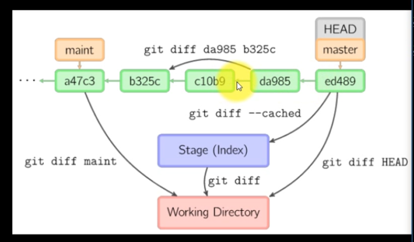
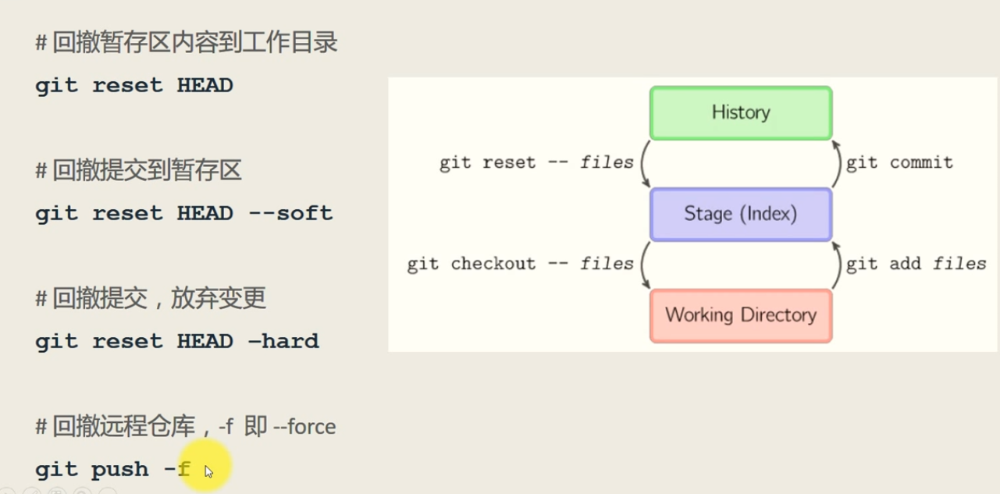

### [user]
        email = keke@qq.com
        name = keyongteacher  

### [alias]
        ci = commit
        st = status
        ad = add .
        hi = log --pretty=format:'%h %ad | %s%d' --graph --date=short

### git config --list
    git config --list
    git config --gloabl alias.ci=commit
    git config --global credential.helper wincred  可以保存https协议每次输入密码的麻烦

### ssh协议生成密钥命令
    ssh-keygen -t rsa -C "3375630896@qq.com"

    把公钥放到github网站上
    cat ~/.ssh/id_rsa.pub

    profile-setting-ssh and gpg keys

### 列出常用命令
    git

    列出所有子命令
    git help -a

    列出文件修改历史记录
    git blame filename
    git blame -L 0,100 filename

### 列出要清除的文件
    git clean -n 
    清除文件
    git clean -f
    git clean -x
    会清理gitignore的内容

    git status -sb short branch 简短的列出变更

    git rm 删除文件
    git mv 重命名或移动文件
    git reset hash | head 撤回到某个commit  

### git show HEAD 显示当前提交的变更 
    git show HEAD^ 上一个提交  HEAD^^上2个提交，也可以写为HEAD~2
    git diff 

### git commit 规范
    type(scope):fix xxx 

    body 

    footer 

    示例
    docs(file):fix file

    close #1  关闭bug  

    git hi filename (git config --global alias.hi=log 这个命令) 可以看到这个文件的提交历史记录

### git diff  

### HEAD 代表当前的commit
    HEAD^ 代表上一个commit
    HEAD^^ 代表上2个commit = HEAD~2

    git show HEAD
    git hi fileme
    git blame filename
    git diff HEAD  workingdirector commit  当前工作区和最新commit的区别
    git diff --cache  index/stage  commit  当前暂存区和最新commit
    git diff workdirectory index/stage     当前工作区和暂存区
    git diff HEAD^ HEAD^^ commit1 commit2  当前commit1,commit2的区别
### git tag 
    git tag tagName commit 在某个提交上面打标记
    
    在某个提交上面commit
    可以
    git show
    git diff
    git tag  

### reset 回撤操作
    git add  ---> git checkout --files
    git commit ---> git reset -- files 

  

    git reset HEAD  回撤  暂存区内容  到工作目录
    git reset HEAD^ -- soft 回撤提交到  暂存区

    git reset HEAD^ --hard 回撤提交

    git push -f 强制提交撤回的记录
 
### git tag  
    git tag 列出所有标签

    git tag tagName commit  给某个提交打标签

    git tag -d tagName  删除某个提交的标签

    git tag tagName HEAD~4  给第4个commit打标签

    git push origin --tags   向远程仓库推送所有打的标签

    git push origin tagName  推送某个标签

    git tag tagName -m "message"

    git push origin :refs/tags/v0.0 删除远程仓库的某个标签

### git branch   
    git branch xxx 创建分支

    git branch -v 查看所有分支，且显示每个分支目前的最新提交commit

    git checkout xx 切换到xx分支上

    git merge xx 在当前分支上合并xx分支上的提交 

    git branch -d xx 删除xx分支
    
    ----------------------------------
    git branch xxx 创建分支
    
    git branch -v 查看所有分支，且显示每个分支目前的最新提交commit
    
    git checkout xx 切换到xx分支上
    
    git merge xx 在当前分支上合并xx分支上的提交 
    
    git branch -d xx 删除xx分支
    
    git branch -r 列出远程分支
    
    git checkout -b xx 创建分支且切换分支
    
    git branch -m/M old_branch new_branch 修改分支名称
    git branch -d/D branch 删除分支
    
    git branch --merged
    git branch --no-merged 查看已经合并的分支
    
    git branch -r --mereged 列出远程合并的分支
    
    git checkout -t origin/foo 取出远程foo分支
    
    git push origin <space>:<remote branch> 删除远程分支
    git fetch -p
    
    git merge branch_name 合并分支
    
    git merge --no-ff 合并分支，拒绝fast forward ，产生合并commit
    
    git stash 保存进度
    
    git stash pop 弹出进度
    
    git stash list 查看stash 列表
    
    git stash clear 删除stash 列表
    
    
    
### 集中式工作流  
    需要邀请对方加入协作，大家撸的代码再推送再远程仓库里     
    
    1 冲突时，解决冲突的文件即可
    2 git pull --rebase    
    解决冲突文件，git rebase --continue   
    git add .
    git rebase --continue   
    
     

### 功能 式工作流  
    同样需要邀请对方 加入协作  
    开发时，开分支即可，再git push 远程地址 新分支  
    功能完成后，可以发起Pull request 请求合并  

### forking 工作流   
    1 github fork 别人的项目  
    2 本地clone fork 好的项目  
    3 完成基本的代码修改,push 到自己fork的项目  
    4 在github 发起pr 请求合并  
    5 自己要同步fork原仓库，记得git remote add upstream 原仓库  

